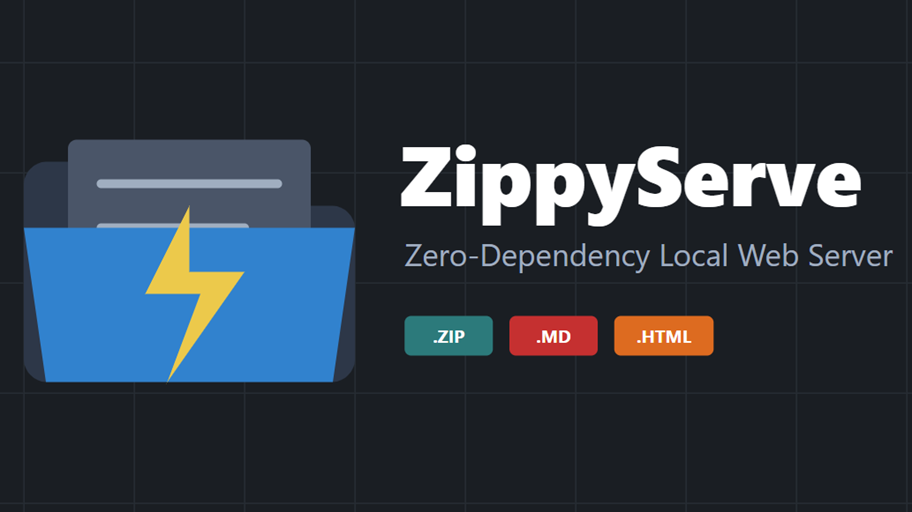

<!--
This file is part of ZippyServe
README.md
Author(s): Gabriel Mongefranco.
Created: 2026-07-26
Last Modified: 2026-07-26
Summary: Provides an overview of the project, in Markdown format.
Notes: See README file for documentation and full license information.

Copyright © 2026 The Regents of the University of Michigan

This program is free software: you can redistribute it and/or modify
it under the terms of the GNU General Public License as published by
the Free Software Foundation, either version 3 of the License, or (at your option) any later version.
This program is distributed in the hope that it will be useful,
but WITHOUT ANY WARRANTY; without even the implied warranty of
MERCHANTABILITY or FITNESS FOR A PARTICULAR PURPOSE. See the
GNU General Public License for more details.
You should have received a copy of the GNU General Public License along
with this program. If not, see <https://www.gnu.org/licenses/>.
-->

# ZippyServe

## Description
ZippyServe is a zero-dependency local web server. It lets you test single-page apps quickly. It serves directories, zips, HTML, and Markdown.

ZippyServe solves local SPA testing. It requires no bulky web servers. Precompiled binaries ship for Windows, Linux, and macOS in `/bin` — no runtime install needed. It serves local directories, zips, and tarballs. It routes index files and READMEs. It blocks upward directory traversal securely. It renders GitHub-flavored Markdown natively. It launches your browser to localhost automatically. Copy the run script and `/bin` into any project to test it locally. Unlike similar web servers, ZippyServe is licensed under the GPLv3 open source license, allowing re-use and bundling with many other open source or commercial projects.

## Quick Start Guide
+ Copy `bin/` and the run script matching your OS into your project's root.
+ Run it: `.\run-windows.ps1` (Windows), `./run-linux.sh` (Linux), or double-click `run-mac.command` (macOS).
+ Your default browser opens automatically to `http://localhost:8010`.
+ Override the port or serve a different directory/zip: `.\run-windows.ps1 -Port 9000` or `./run-linux.sh --dir ./dist`.
+ Building from source instead of using the checked-in binaries: run `.\build.ps1` (Windows) or `./build.sh` (Linux/macOS) to cross-compile all targets into `/bin`.

## Documentation
+ The full documentation is available at: https://michmed.org/efdc-kb
+ Built-in MCP server design notes (prototype, opt-in via `-mcp`): [docs/mcp-design.md](docs/mcp-design.md)

## About the Team
The [Mobile Technologies Core](https://depressioncenter.org/mobiletech) provides investigators across the University of Michigan the support and guidance needed to utilize mobile technologies and digital mental health measures in their studies. Experienced faculty and staff offer hands-on consultative services to researchers throughout the University – regardless of specialty or research focus.

Learn more at: [https://depressioncenter.org/mobiletech](https://depressioncenter.org/mobiletech).

## Contact
To get in touch, contact the individual developers in the check-in history.

If you need assistance identifying a contact person, email the EFDC's Mobile Technologies Core at: efdc-mobiletech@umich.edu.

## Credits
#### Contributors:
+ [Eisenberg Family Depression Center](https://depressioncenter.org) [(@DepressionCenter)](https://github.com/DepressionCenter)
+ [Gabriel Mongefranco](https://gabriel.mongefranco.com) [(@gabrielmongefranco)](https://github.com/gabrielmongefranco)

#### This work is based in part on the following projects, libraries and/or studies:
+ [Go](https://golang.org/) [(@golang)](https://github.com/golang)

## License
Copyright © 2026 The Regents of the University of Michigan
Licensed under GNU General Public License v3.0.

## Citation
>_Mongefranco, Gabriel (2026). ZippyServe. University of Michigan. Software. https://github.com/DepressionCenter/ZippyServe_  
​​​​​​​     _DOI: [https://doi.org/10.5281/zenodo.21613944](https://doi.org/10.5281/zenodo.21613944)_

----

Copyright © 2026 The Regents of the University of Michigan
